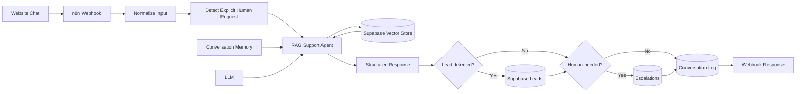
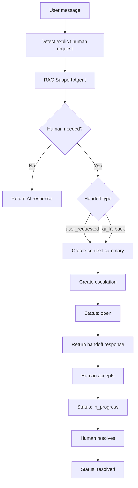

# RAG Customer Support Agent

A production-style **Retrieval-Augmented Generation (RAG) customer support agent** built with **n8n, Supabase, pgvector, and an LLM**.

The project demonstrates how a website assistant can answer questions from a controlled business knowledge base, capture leads, preserve conversation context, and hand conversations to a human when the AI is uncertain **or when the customer explicitly asks for a person**.

> **Portfolio project:** BrightDesk is a fictional SaaS company created only for this demo.

## What this project demonstrates

- Retrieval-Augmented Generation with Supabase + pgvector
- n8n AI Agent orchestration
- Grounded answers from company documentation
- Session-based conversation memory
- Structured lead extraction
- Supabase lead storage
- Human handoff for both uncertain AI responses and explicit customer requests
- Conversation logging for observability
- Webhook API for website/chat integrations
- Clear separation between retrieval, business rules, and response generation

## Architecture



## Why RAG instead of a normal chatbot?

A normal LLM can produce plausible answers even when it does not know the company's real policies or product details.

This workflow retrieves relevant information from the company's knowledge base first and instructs the agent to answer from that context. When useful context is not available, the workflow can flag the conversation for human follow-up instead of confidently guessing.

It also treats an explicit request such as **"I want to talk to a human"** as a first-class routing event rather than another prompt for the bot to answer.

## Demo use case

The included demo knowledge base represents **BrightDesk**, a fictional B2B customer-support platform.

Example questions:

- "Does BrightDesk integrate with HubSpot?"
- "Can I cancel my monthly plan?"
- "Do you offer an API?"
- "What happens if I exceed my plan limits?"
- "Do you support SSO?"
- "I want to talk to a human."

The point is not the fictional company. The same architecture can be used for SaaS products, agencies, internal knowledge assistants, ecommerce support, onboarding assistants, and other knowledge-heavy workflows.

## Tech stack

| Component | Role |
|---|---|
| n8n | Workflow orchestration |
| Supabase | Postgres database + vector store |
| pgvector | Semantic similarity search |
| OpenAI-compatible LLM | Response generation |
| OpenAI embeddings | Document embeddings |
| Webhook API | Website/chat integration |

The LLM and embedding provider can be replaced with another provider supported by n8n.

## Repository structure

```text
.
├── workflow/
│   └── rag-customer-support-agent.json
├── supabase/
│   └── schema.sql
├── knowledge-base/
│   └── brightdesk.md
├── docs/
│   └── architecture.md
├── .env.example
├── LICENSE
└── README.md
```

## Core design decisions

### 1. Retrieval before confident answers
The agent is instructed to use the vector knowledge base for product, pricing, policy, integration, and support questions.

### 2. Human handoff is a workflow, not a message
The agent supports two kinds of escalation:

- **AI-triggered escalation** — the assistant cannot answer reliably from the available knowledge base or the request requires human review.
- **User-triggered handoff** — the customer explicitly asks to speak with a person.

For a user-triggered handoff, the workflow does not keep troubleshooting or pretend to be a human. It:

1. detects the explicit request,
2. acknowledges the handoff,
3. preserves the session and recent conversation context,
4. creates a concise handoff summary,
5. creates an escalation record,
6. marks the handoff as `open`, and
7. returns a response that makes it clear the conversation has been handed to support.

The escalation record can then move through:

```text
open -> in_progress -> resolved
```

This avoids a common chatbot failure mode where the bot says *"I'll forward this to support"* but no structured ownership, context transfer, or handoff state exists behind that sentence.

A production integration should additionally notify a real support destination and pause automated replies while a human owns the conversation.

### Human handoff flow



### 3. Supabase instead of spreadsheets
Leads, escalations, and conversation logs are stored in Postgres rather than a spreadsheet. This makes the workflow easier to query, extend, and integrate with other systems.

### 4. Lead capture is contextual
The assistant does not block the conversation until a visitor provides an email address. It can help first and capture contact information when the user provides it or asks for follow-up.

### 5. Business rules stay visible
The workflow keeps important routing decisions outside a giant system prompt wherever practical. Explicit human-request detection is handled deterministically before the agent response is normalized.

## Setup

### 1. Create a Supabase project

Open the SQL editor and run:

```
supabase/schema.sql
```

This creates the demo tables, vector-search function, and handoff fields used by the workflow.

### 2. Load the knowledge base

Use the content in:

```
knowledge-base/brightdesk.md
```

Chunk and embed the document into the `documents` table. You can do this with an n8n ingestion workflow or your preferred embedding pipeline.

### 3. Import the n8n workflow

Import:

```
workflow/rag-customer-support-agent.json
```

Then connect your own credentials for:

- LLM provider
- Embeddings provider
- Supabase

### 4. Configure environment values

Use `.env.example` as a reference. Never commit real keys.

### 5. Test the webhook

Example request:

```bash
curl -X POST https://YOUR_N8N_DOMAIN/webhook/rag-customer-support \
  -H "Content-Type: application/json" \
  -d '{
    "message": "Does BrightDesk integrate with HubSpot?",
    "session_id": "demo-user-001"
  }'
```

Expected response shape:

```json
{
  "reply": "Yes. BrightDesk supports HubSpot on the Growth and Scale plans.",
  "needs_human": false,
  "handoff_type": null,
  "handoff_status": null
}
```

Example explicit handoff request:

```bash
curl -X POST https://YOUR_N8N_DOMAIN/webhook/rag-customer-support \
  -H "Content-Type: application/json" \
  -d '{
    "message": "I want to talk to a human.",
    "session_id": "demo-user-002"
  }'
```

Expected behavior:

- `needs_human` is `true`
- `handoff_type` is `user_requested`
- an escalation record is created with status `open`
- the escalation stores a reason and handoff summary
- the assistant does not continue trying to solve the issue as AI

## Database tables

The demo schema includes:

- `documents` — embedded knowledge chunks
- `leads` — captured lead details
- `conversation_logs` — user/agent interactions, including handoff type
- `escalations` — human-review queue with handoff type, summary, assignment, and status fields

## Security notes

This repository contains **no production credentials or private customer data**.

For a real deployment:

- keep service-role keys server-side only
- validate webhook input
- apply Row Level Security where appropriate
- avoid logging sensitive personal information
- rate-limit public endpoints
- sanitize uploaded knowledge documents
- use a separate ingestion pipeline for trusted content

## What I would add in production

- support-channel notification when an escalation is created
- automatic AI pause/resume tied to human ownership state
- persistent Postgres-backed conversation memory
- metadata filtering by product/version/tenant
- retrieval quality evaluation
- automated knowledge-base ingestion
- source citations in responses
- retry/fallback handling for model and database failures
- monitoring and alerting
- human review dashboard

## Project background

This repository is a **public, sanitized portfolio implementation** based on patterns I have worked with in private AI assistant and customer-support automation projects.

The public version uses fictional business data and a clean standalone architecture so the workflow can be inspected without exposing production code, customer information, credentials, internal prompts, or proprietary project details.

The workflow, prompts, database structure, and documentation in this repository were created specifically for this public portfolio implementation.

## License

MIT License. See [LICENSE](LICENSE).
